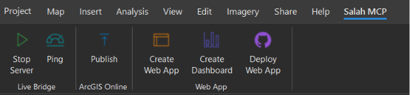
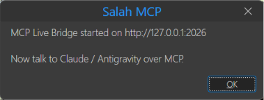
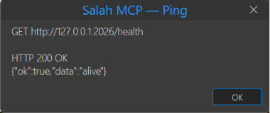
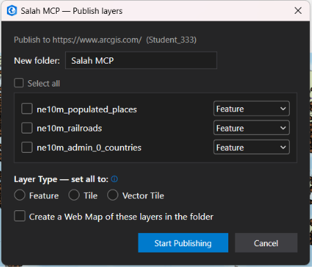
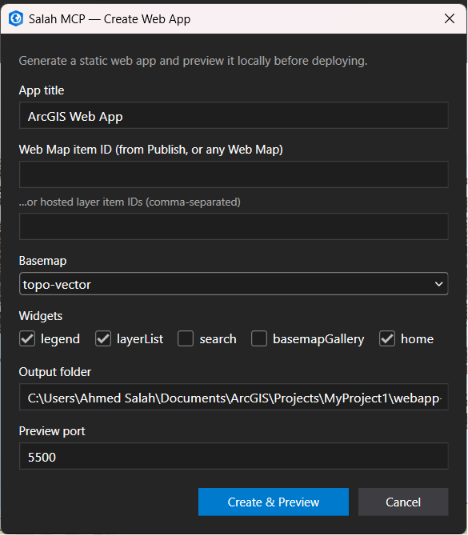
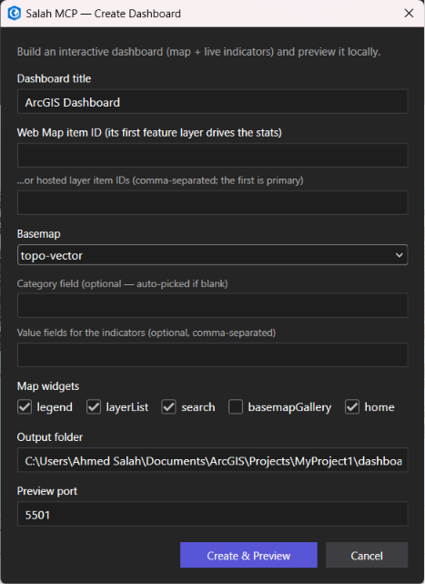
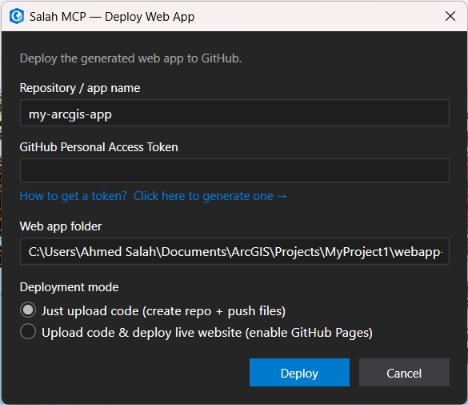

# ArcGIS Pro Salah MCP

**Drive the whole ArcGIS stack with natural language through any MCP agent
(Claude **or** Google Antigravity) — or with one click from an ArcGIS Pro ribbon.**

A four-layer [Model Context Protocol](https://modelcontextprotocol.io) server.
You describe what you want, and your agent calls the right ArcGIS operations — from
desktop geoprocessing, to publishing on ArcGIS Online, to a finished web app or
an interactive dashboard. Because it speaks the standard MCP stdio transport it is
**client-agnostic** — use it from Claude, Google Antigravity, or any other MCP
client. The same building blocks are also wired to a **Salah MCP ribbon** inside
ArcGIS Pro, so you can publish and build apps with no agent at all.

---

## About us

**ArcGIS Pro Salah MCP** is an independent integration that connects Esri's
ArcGIS platform to AI agents through the open Model Context Protocol. It is the
ArcGIS Pro sibling of [`qgis_salah_mcp`](https://github.com/Ahmed-salah-muhammed/qgis_salah_mcp):
same goal — let an assistant operate a full GIS end to end — but for Esri's
commercial stack instead of QGIS.

The vision is **one brain, four hands**: a single server that can analyze data in
ArcGIS Pro, publish it to ArcGIS Online, and turn it into a shareable web app or
dashboard — in one conversation, or one ribbon click.

- **Author:** Ahmed Salah Muhammed — [github.com/Ahmed-salah-muhammed](https://github.com/Ahmed-salah-muhammed)
- **License:** MIT
- **Not affiliated with Esri.** ArcGIS, ArcGIS Pro and ArcPy are trademarks of Esri.

---

## The four layers

| Layer | Prefix | Backend | What it does |
| --- | --- | --- | --- |
| **1 · Pro** | `pro_*` | ArcPy | Geoprocessing on `.aprx` projects & geodatabases (buffer, clip, symbology, export, …) |
| **1b · Live** | `live_*` | .NET add-in (loopback HTTP) | Drive the **open** ArcGIS Pro session (list/zoom/query/run GP/export) |
| **2 · Portal** | `portal_*` | ArcGIS API for Python | Publish layers to **ArcGIS Online / Portal**, manage items, build Web Maps |
| **3 · WebApp** | `webapp_*` | ArcGIS Maps SDK for JS **5.0** | Generate a static **web app** *or* an interactive **dashboard**, then deploy to GitHub |

**The signature workflow:** `Pro (analyze)` → `Portal (publish)` → `WebApp / Dashboard (visualize)` → `GitHub (deploy)`.

---

## Two ways to use it

1. **From an AI agent** — chat in natural language and the agent chains the
   `pro_*` / `portal_*` / `webapp_*` tools. Works with **any MCP client** —
   [Claude](https://claude.ai/download) **and [Google Antigravity](https://antigravity.google)**
   are both supported (the server speaks the standard MCP stdio transport, so it
   is client-agnostic). Best for analysis + automation.
2. **From the ArcGIS Pro ribbon** — the **Salah MCP** tab gives you one-click
   **Publish**, **Create Web App**, **Create Dashboard** and **Deploy Web App**
   buttons. No agent required; the buttons shell out to the same Python.

> **Status (v0.1):** Pro geoprocessing, project/layer & symbology tools, portal
> publishing (feature / **tile** / **vector tile**), web-map and **web-app +
> dashboard** generation (ArcGIS Maps SDK for JS **5.0** with Calcite + map
> components), and a one-click **GitHub deploy** are all implemented, plus a live
> `.NET` bridge (loopback, no token) with a **6-button Salah MCP ribbon**
> (add-in **v0.1.2**). Default portal is **ArcGIS Online**; the portal URL is
> configurable, so **Enterprise Portal** is a small next step.

---

## Why ArcGIS Pro needs a different design than QGIS

QGIS is open-source, so `qgis_salah_mcp` runs a Python socket server *inside* the
live QGIS session. ArcGIS Pro does **not** allow that: ArcPy works on
`.aprx`/`.gdb` files on disk and **cannot attach to a running Pro session** (an
Esri limitation). Driving the *live* session requires a **.NET add-in** built
with the ArcGIS Pro SDK. So this project pairs the **headless ArcPy** path
(`pro_*`) with a **live `.NET` bridge** (`live_*`): a loopback HTTP add-in that
runs inside the open Pro session. See
[`ProSalahBridge/`](ProSalahBridge/) and [`docs/PROTOCOL.md`](docs/PROTOCOL.md).

---

## Architecture

```
You (natural language)                ArcGIS Pro ribbon (Salah MCP tab)
        │                                        │
        ▼                                        ▼
   Claude Desktop                        one-click buttons shell out
        │  stdio                                 │ to arcgispro-py3
        ▼                                        ▼
   MCP Server (FastMCP)                 ← src/arcgis_pro_salah_mcp/server.py
        ├── pro_*     → ArcPy            (arcgispro-py3 interpreter, files on disk)
        ├── live_*    → HTTP (loopback)  → .NET add-in inside the OPEN Pro session
        ├── portal_*  → arcgis (Py API)  → ArcGIS Online / Portal
        └── webapp_*  → static generator → Maps SDK for JS 5.0 app / dashboard
                                              └─ optional → GitHub repo + Pages
```

See [`docs/ARCHITECTURE.md`](docs/ARCHITECTURE.md) for the full design.

---

## Getting started (tutorial)

### Prerequisites

- **ArcGIS Pro 3.x** (provides ArcPy via its bundled `arcgispro-py3` Python).
- For publishing: be **signed in** to ArcGIS Online / your portal in ArcGIS Pro.
- For the agent workflow: an **MCP client** — **Claude Desktop** *or* **Google
  Antigravity** (or any other MCP-capable client).
- For the ribbon buttons: build & install the **ProSalahBridge** add-in (below).

### Step 1 — Install the package into ArcGIS Pro's Python

The `pro_*`, `webapp_*` and the ribbon buttons run inside ArcGIS Pro's bundled
interpreter, so install the package there:

```bat
"C:\Program Files\ArcGIS\Pro\bin\Python\envs\arcgispro-py3\python.exe" -m pip install -e .
```

> The web-app and dashboard generators only need the package importable (no heavy
> deps). If pip can't write to `Program Files` without admin, it falls back to your
> **user site**, which `arcgispro-py3` reads automatically — that's fine. If you
> only want the generators (and not the full MCP server deps), use
> `… -m pip install -e . --no-deps`.

For the Portal layer, add the optional `arcgis` dependency:

```bat
"...\arcgispro-py3\python.exe" -m pip install -e ".[portal]"
```

> **Self-healing:** if the MCP server starts under the wrong Python, it locates
> `arcgispro-py3` (env override → common paths → registry) and re-executes itself
> there. See `bootstrap.py`.

### Step 2 — Install the Salah MCP ribbon

Build the add-in and install it so the **Salah MCP** tab appears in ArcGIS Pro:

1. Open `ProSalahBridge/ProSalahBridge.slnx` in **Visual Studio 2026** (with the
   ArcGIS Pro SDK), or build from a shell:
   ```bat
   dotnet build ProSalahBridge\ProSalahBridge.csproj
   ```
2. **Close ArcGIS Pro**, then double-click the built
   `ProSalahBridge\bin\Debug\net10.0-windows\ProSalahBridge.esriAddinX`.
3. Reopen ArcGIS Pro → the **Salah MCP** tab is on the ribbon.

> Verify the loaded build in **Project ▸ Add-In Manager** — the version should
> read **0.1.2**. Bump `Config.daml`'s `version` whenever you change the add-in.

### Step 3a — Use it from the ArcGIS Pro ribbon (no agent)

With a project open, layers in the map, and you signed in:

1. **Publish** → pick feature layers from the checklist, choose a type per layer
   (**Feature / Tile / Vector Tile**), optionally "Create a Web Map", and publish
   straight to your portal into a new folder (with data-derived metadata).
2. **Create Web App** → generate a static Maps SDK for JS app from a Web Map id
   (or layer ids) and preview it on `http://localhost`.
3. **Create Dashboard** → generate an interactive dashboard (map + live
   indicators + breakdown + a "features in view" list, with a Light/Dark toggle)
   and preview it.
4. **Deploy Web App** → push the previewed folder to a new GitHub repo and
   (optionally) enable GitHub Pages for a live URL.

### Step 3b — Use it from an MCP client (Claude **or** Antigravity)

The server speaks the **standard MCP stdio transport**, so the registration is the
same everywhere: point an `mcpServers` entry at the installed entry point. Pick
your client below — the JSON is identical, only the file it goes in differs.

**Claude Desktop** — edit `claude_desktop_config.json`
(Windows: `%APPDATA%\Claude\claude_desktop_config.json`):

```json
{
  "mcpServers": {
    "arcgis_pro_salah": {
      "command": "C:\\Program Files\\ArcGIS\\Pro\\bin\\Python\\envs\\arcgispro-py3\\python.exe",
      "args": [
        "-m",
        "arcgis_pro_salah_mcp.server"
      ],
      "env": {
        "PYTHONPATH": "your\\path\\MCP\\ArcGIS Pro Salah MCP\\src" // enter your path
      }
    }
  }
}
```

**Google Antigravity** — open the Agent panel → **MCP servers** → **Edit raw
config** (`mcp_config.json`) and add the **same** block:

```json
{
  "mcpServers": {
    "arcgis_pro_salah": {
      "command": "C:\\Program Files\\ArcGIS\\Pro\\bin\\Python\\envs\\arcgispro-py3\\python.exe",
      "args": [
        "-m",
        "arcgis_pro_salah_mcp.server"
      ],
      "env": {
        "PYTHONPATH": "your\\path\\MCP\\ArcGIS Pro Salah MCP\\src" // enter your path
      }
    }
  }
}
```

Save, then reload the MCP servers in Antigravity — the `pro_*`, `live_*`,
`portal_*` and `webapp_*` tools appear in the agent's tool list, exactly as in
Claude. (Any [environment variable](#configuration-environment-variables) can go in
the `env` block; it's shown here on Antigravity but works for either client.)

> Always point `command` at the installed **entry point**
> (`arcgis-pro-salah-mcp.exe`), not at `server.py` — package-relative imports only
> resolve when the package is installed. The path is the same regardless of client.

Then build a sample geodatabase and try the end-to-end story (works the same from
Claude or Antigravity):

```bat
"...\arcgispro-py3\python.exe" demos\setup_sample.py
```

> **You:** "Buffer `sample.gdb/cities` by 50 km, publish the result to my ArcGIS
> Online as 'City Service Areas', build a web map, then generate a dashboard."

The agent (Claude or Antigravity) chains:

1. `pro_buffer("sample.gdb/cities", "sample.gdb/cities_buf", "50 Kilometers")`
2. `portal_connect(profile="agol")` → `portal_publish_layer("…cities_buf", "City Service Areas")` → item id
3. `portal_create_webmap("City Service Areas", [item_id])` → webmap id
4. `webapp_create_dashboard("City Service Areas", webmap_id=…)` → static dashboard

Serve any generated folder locally:

```bat
cd webapp-build && python -m http.server 5500
```

---

## Two ways to build an app: static vs. custom

Once your data is in the portal, there are **two routes** to a finished
application — pick by how much control you want. Both reference your published
data by its **Web Map / layer item‑id**, so the app inherits the symbology,
labeling and popups you published.

### 1) Static apps (generated) — the quick path

The `webapp_create` / `webapp_create_dashboard` tools (and the **Create Web App**
/ **Create Dashboard** ribbon buttons) emit an opinionated, no‑build static site
(ArcGIS Maps SDK for JS 5.0 + Calcite + map components). Give them a **Web Map
item‑id** (or layer item‑ids) and they wire up the map, widgets, indicators and
interactions for you. Fast, consistent, zero hand‑coding.

### 2) Custom apps (built with Claude) — your design & workflow

When you want **your own design, layout, branding, workflow and concept**, skip
the generator and just **describe the app to Claude**. Claude hand‑writes a
bespoke ArcGIS Maps SDK for JS 5.0 application around your published **item‑id** —
custom Calcite panels, charts, tools and interaction logic, exactly to your spec.

**Typical flow:**

1. **Publish** your data / web map (ribbon **Publish**, or `portal_publish_layer`
   + `portal_create_webmap`) and copy the **item‑id** from your portal.
2. In Claude, describe the app and hand it the item‑id, e.g.:

   > **You:** "Build a single‑page flood‑response app. Left: a Calcite panel with
   > a date slider and a 'shelters only' filter. Center: the map from Web Map
   > item‑id `a1b2c3…`. Right: a live count of affected buildings and a bar chart
   > by district that updates with the map extent. Dark theme, our logo in the
   > header. Use ArcGIS Maps SDK for JS 5.0."

3. Claude generates the full app (and can drop the files into a folder for you).
4. Preview it locally (`python -m http.server`), then deploy with **Deploy Web
   App** / `webapp_github_pipeline`.

> The static generators are the quick path; the custom route is the creative one —
> same published data (referenced by **item‑id**), unlimited UI/UX. You can also
> start from a generated app and ask Claude to restyle or extend it.

---

## The Salah MCP ribbon

Once the **ProSalahBridge** add-in is installed, a **Salah MCP** tab appears on
the ArcGIS Pro ribbon. It groups the six buttons into three task areas — **Live
Bridge**, **ArcGIS Online**, and **Web App** — so the whole *analyze → publish →
visualize → deploy* workflow is one click away, no agent required.



| Button | Icon | Group | What it does |
| --- | --- | --- | --- |
| **Start / Stop Server** | green play | Live Bridge | Start/stop the loopback bridge so `live_*` tools can reach the open session |
| **Ping** | cyan gauge | Live Bridge | `GET /health` on the bridge and show the response |
| **Publish** | blue upload | ArcGIS Online | Publish chosen layers (Feature/Tile/Vector Tile) to your portal + optional Web Map |
| **Create Web App** | orange browser | Web App | Generate a static Maps SDK for JS app and preview it on localhost |
| **Create Dashboard** | indigo bar-chart | Web App | Generate an interactive dashboard and preview it on localhost |
| **Deploy Web App** | GitHub mark | Web App | Push the generated folder to GitHub and (optionally) enable Pages |

Icons are generated from the official [Calcite Design System](https://developers.arcgis.com/calcite-design-system/icons/)
set (plus GitHub's Octicons for the Deploy mark) — see `ProSalahBridge/Images/make_icons.py`.

The **Publish** and **Deploy** progress windows are minimizable / hideable (a
**Hide** button + taskbar), so long uploads can run in the background while you
keep working in Pro.

### Live Bridge — Start Server & Ping

The **Start Server** button toggles the loopback HTTP bridge (port `2026`, no
token) that runs *inside* the open Pro session. Once it's up, the `live_*` tools
— and Claude / Antigravity over MCP — can list layers, zoom, query and run
geoprocessing against the map you're actually looking at.

| Start the bridge | Confirm it's alive (Ping) |
| --- | --- |
|  |  |

- **Start Server** flips to **Stop Server** while running and shows the bridge URL
  (`http://127.0.0.1:2026`). From here you "talk to Claude / Antigravity over MCP."
- **Ping** issues `GET /health` and prints the raw response — `HTTP 200 OK` with
  `{"ok":true,"data":"alive"}` means the bridge is reachable and the `live_*`
  layer is ready.

### ArcGIS Online — Publish

**Publish** uploads the layers you pick straight to the portal you're signed into
inside ArcGIS Pro — into a brand-new folder, with metadata derived from the data
itself.



- **New folder** — names the portal folder the items land in (e.g. `Salah MCP`).
- **Layer checklist** — tick the layers to publish (or **Select all**); set a
  **per-layer type** with the dropdown, or flip every layer at once with the
  **Layer Type** radios — **Feature**, **Tile**, or **Vector Tile**.
- **Create a Web Map of these layers** — optionally assembles a Web Map in the
  same folder, ready to feed straight into **Create Web App** / **Create Dashboard**.
- **Start Publishing** runs the upload; the progress window can be hidden so it
  keeps going in the background.

### Web App — Create Web App

**Create Web App** generates an opinionated, no-build static site (ArcGIS Maps SDK
for JS 5.0 + Calcite) from a Web Map item-id (or hosted layer ids) and previews it
locally before you deploy.



- **App title** — the header shown in the generated app.
- **Web Map item ID** (from Publish, or any Web Map) — the data source; or paste
  one or more **hosted layer item IDs** instead.
- **Basemap** — the base layer (e.g. `topo-vector`).
- **Widgets** — toggle **legend**, **layerList**, **search**, **basemapGallery**,
  and **home**.
- **Output folder** + **Preview port** — where the site is written and the
  `localhost` port it's served on. **Create & Preview** builds it and opens it in
  your browser.

### Web App — Create Dashboard

**Create Dashboard** builds an interactive dashboard — a map plus live indicators,
a category breakdown, and a "features in view" list — whose statistics are driven
by a feature layer. Fields are introspected in the browser, so it auto-picks
sensible defaults when you leave the optional fields blank.



- **Dashboard title** — header for the dashboard.
- **Web Map item ID** — its **first feature layer drives the stats** (or paste
  hosted layer ids; the first is primary).
- **Category field** *(optional)* — what the breakdown groups by; **auto-picked**
  if left blank.
- **Value fields for the indicators** *(optional)* — comma-separated fields to
  surface as live indicators.
- **Map widgets**, **Output folder**, **Preview port** — same controls as Create
  Web App. **Create & Preview** generates and opens the dashboard.

### Web App — Deploy Web App

**Deploy Web App** pushes a folder you've already generated to a new GitHub repo,
and can flip on GitHub Pages for a live public URL.



- **Repository / app name** — the new repo to create (e.g. `my-arcgis-app`).
- **GitHub Personal Access Token** — needs rights to **create repos** and **write
  files**; the dialog links to *how to generate one*. See
  [Deploy to GitHub](#deploy-to-github) for the exact scopes.
- **Web app folder** — the generated folder to upload (defaults to your last
  Create Web App / Dashboard output).
- **Deployment mode** — **Just upload code** (create repo + push files) or
  **Upload code & deploy live website** (also enables GitHub Pages). **Deploy**
  runs it; the progress window is hideable.

---

## Authentication (Portal layer)

Prefer a stored **profile** so credentials never live in code or chat. Once, from
any Python with `arcgis` installed:

```python
from arcgis.gis import GIS
GIS("https://www.arcgis.com", username="you", password="…", profile="agol")
```

Then set `ARCGIS_PROFILE=agol` (or pass `profile="agol"` to `portal_connect`).
The ribbon's **Publish** button uses the account you're already signed into inside
ArcGIS Pro (`GIS("pro")`), so no extra setup is needed there.

---

## Deploy to GitHub

The **Deploy Web App** button (and the `webapp_github_pipeline` tool) create a
public repo, push the static files via the contents API, and optionally enable
GitHub Pages. Your token must be able to **create repos** and **write files**:

- **Classic token (simplest):** the **`repo`** scope covers everything.
- **Fine-grained token:** Repository access **All repositories**, with
  **Administration + Contents + Pages = Read and write**. A token scoped to "only
  select repositories" cannot create new repos.

Not sure what your token can do? Run the bundled checker (it never reveals your
token):

```bat
python demos\check_github_token.py --try-create
```

You want to see **✓ CREATE OK** and **✓ PUSH OK**.

---

## Tools

**Pro (`pro_*`):** ping, get_info, project_info, save_project, list_layers,
add_layer, remove_layer, rename_layer, set_visibility, layer_summary,
describe_layer, get_features, select_by_expression, add_field, calculate_field,
field_statistics, buffer, clip, spatial_join, dissolve, merge, reproject,
repair_geometry, extract, apply_categorized_symbology, apply_graduated_symbology,
set_opacity, export_layer, export_image, export_pdf, export_map_series, run_gp,
execute_code.

**Live (`live_*`)** — the OPEN Pro session via the .NET bridge: ping,
list_layers, zoom_to, query, run_gp, add_layer, export_layout, get_request.

**Portal (`portal_*`):** connect, whoami, publish_layer, search_items, get_item,
create_webmap, set_layer_symbology, set_layer_labeling, share_item.

**WebApp (`webapp_*`):** create (static app), **create_dashboard** (interactive
dashboard), **github_pipeline** (deploy to GitHub + Pages).

---

## Configuration (environment variables)

| Variable | Default | Purpose |
| --- | --- | --- |
| `ARCGIS_PORTAL_URL` | `https://www.arcgis.com` | Portal target (AGOL or Enterprise) |
| `ARCGIS_PROFILE` | — | Stored ArcGIS API for Python profile name |
| `ARCGIS_JS_SDK_VERSION` | `5.0` | Maps SDK for JS version pinned in generated apps |
| `ARCGIS_WEBAPP_OUT` | `webapp-build` | Default output folder for generated apps |
| `ARCGIS_BRIDGE_PORT` | `2026` | Live bridge loopback port (no token) |
| `ARCGIS_BRIDGE_READONLY` | `false` | Truthy ⇒ `live_*` refuses commands that change the session |
| `CLI_ANYTHING_ARCGIS_PYTHON` / `ARCGIS_PRO_PYTHON` | — | Explicit path to `arcgispro-py3` python.exe |

---

## Develop & test

Core tests run without any ArcGIS install (CI runs this):

```bash
PYTHONPATH=src python -m pytest tests/test_core.py
```

They cover the result envelope/guard behavior, graceful ArcPy/bridge-absent
degradation, the metadata inference, and the **web-app + dashboard generators**.

### Regenerating the ribbon icons

The icons are rasterized from the official Calcite/Octicons SVGs by
`ProSalahBridge/Images/make_icons.py` (dev-only; needs `matplotlib`,
`svgpath2mpl`, `Pillow`):

```bat
pip install matplotlib svgpath2mpl pillow
python ProSalahBridge\Images\make_icons.py
```

---

## Repository layout

```
src/arcgis_pro_salah_mcp/
  server.py          FastMCP server — registers all pro_/live_/portal_/webapp_ tools
  bootstrap.py       self-healing arcgispro-py3 discovery
  config.py          env-driven config (portal URL, profile, JS SDK version, bridge port)
  _result.py         {"ok": ...} envelope + guard decorator
  pro/               Layer 1  — ArcPy ops + data-derived metadata
  live/              Layer 1b — client/ops/policy for the live .NET bridge
  portal/ops.py      Layer 2  — ArcGIS API for Python
  webapp/            Layer 3  — generator.py (web app), dashboard.py (dashboard),
                     github.py (deploy), templates/ (index.html, app.js,
                     dashboard.html, dashboard.js)
ProSalahBridge/      the ArcGIS Pro .NET add-in (live bridge + Salah MCP ribbon)
tests/test_core.py   backend-free tests
demos/               setup_sample.py (build a sample.gdb), check_github_token.py
docs/                ARCHITECTURE.md, PROTOCOL.md
```

---

## Troubleshooting

- **"No module named 'arcgis_pro_salah_mcp'"** when a ribbon button runs → install
  the package into `arcgispro-py3` (Step 1).
- **Ribbon button shows old behavior / Add-In Manager shows the wrong version** →
  close Pro, reinstall the rebuilt `.esriAddinX`, confirm the version in Add-In
  Manager. Pro reads it from `…\Documents\ArcGIS\AddIns\ArcGISPro\{guid}\`.
- **Publish: vector tile fails** → vector tiles publish via `arcpy.sharing.Publish`
  and can't use `overwriteExistingService`; a re-publish removes the prior
  same-named item first. Caching finishes server-side after the item appears.
- **Deploy: HTTP 403 "Resource not accessible by personal access token"** → token
  permissions; see [Deploy to GitHub](#deploy-to-github) and run
  `demos/check_github_token.py --try-create`.

---

ArcGIS, ArcGIS Pro and ArcPy are trademarks of Esri; this is an independent
integration and is not affiliated with Esri.
