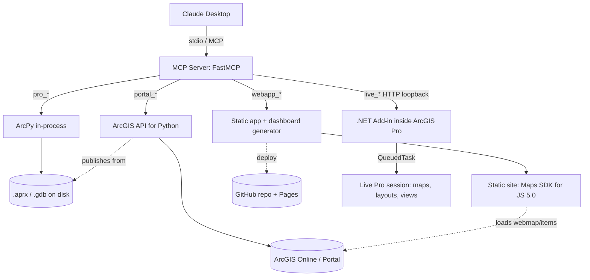

# ArcGIS Pro Salah MCP — System Architecture

> A single MCP server that lets Claude drive the **entire** ArcGIS stack:
> the **live** ArcGIS Pro session (via a .NET add-in), **headless** ArcPy on
> disk, **ArcGIS Online / Portal** (Python API), and a generated **static web
> app** (Maps SDK for JavaScript).
>
> This document is the build spec. Hand it to Claude Code and implement it
> phase by phase (see §10).

---

## 1. Goals

1. **One brain, four hands.** A single FastMCP server exposes four tool groups
   the agent can mix and match in one conversation.
2. **Live + headless.** Drive the *open* Pro session (watch it work) **and**
   batch-process `.aprx`/`.gdb` files with no GUI.
3. **End-to-end story:** `Pro → Portal → WebApp` — author data, publish it,
   visualize it, in one chain.
4. **Configurable target:** ArcGIS Online now, Enterprise Portal later, with no
   code change (env-driven config).

## 2. The core constraint that shapes everything

ArcPy **cannot attach to a running ArcGIS Pro session** (Esri limitation). It
only works on `.aprx`/`.gdb` files on disk. To drive the *live* session you must
run **inside** Pro's process — which means a **.NET add-in** built on the ArcGIS
Pro SDK (Python add-ins are deprecated). Therefore the "Pro" capability has
**two execution backends**:

| Backend | Module | Talks to | Use it for |
| --- | --- | --- | --- |
| **Headless ArcPy** | `pro_*` | `.aprx`/`.gdb` on disk | batch, automation, no GUI |
| **Live .NET bridge** | `live_*` | the open Pro session | interactive, cartography, "watch it work" |

## 3. Component map

```
                         ┌─────────────────────────────┐
                         │        Claude Desktop        │
                         └──────────────┬──────────────┘
                                        │ stdio (MCP)
                                        ▼
                ┌───────────────────────────────────────────────┐
                │   MCP Server  (Python, FastMCP)  — the brain    │
                │   src/arcgis_pro_salah_mcp/server.py            │
                ├───────────────────────────────────────────────┤
                │  pro_*    → import arcpy        (in-process)    │
                │  portal_* → import arcgis       (in-process)    │
                │  webapp_* → file generator      (in-process)    │
                │  live_*   → HTTP client ───────────────────┐   │
                └────────────────────────────────────────────┼───┘
                                                              │ HTTP/JSON
                                                              │ 127.0.0.1:2026
                                                              │ (loopback, no token)
                                                              ▼
                         ┌─────────────────────────────────────────┐
                         │  .NET Add-in  (C#, ArcGIS Pro SDK)        │
                         │  runs INSIDE ArcGIS Pro                   │
                         │   BridgeServer (HttpListener)             │
                         │     → dispatch → QueuedTask.Run(...)      │
                         └──────────────────┬────────────────────────┘
                                            ▼
                         ┌─────────────────────────────────────────┐
                         │  LIVE ArcGIS Pro session                 │
                         │  open project · maps · layouts · views   │
                         └─────────────────────────────────────────┘

   Headless path (no GUI):  pro_*  → ArcPy → .aprx / .gdb files on disk
   Publish path:            portal_* → ArcGIS API for Python → ArcGIS Online
   Visualize path:          webapp_* → static site → ArcGIS Maps SDK for JS
```

### Mermaid (renders on GitHub)



## 4. The four tool groups

### 4.1 `pro_*` — headless ArcPy  (already implemented)
Operates on files. Geoprocessing, project/layer edits, attributes, export.
See `src/arcgis_pro_salah_mcp/pro/ops.py`. Frontier: symbology authoring.

### 4.2 `live_*` — live session via the .NET bridge  (new)
Thin Python HTTP client (`live/client.py`) that POSTs JSON commands to the
add-in. Mirror of the QGIS "live" idea, but the server lives in C# inside Pro.

Minimum command set (see `PROTOCOL.md`):
`ping`, `list_layers`, `zoom_to`, `query`, `run_gp`, `add_layer`,
`export_layout`.

### 4.3 `portal_*` — ArcGIS API for Python  (already implemented)
Connect (AGOL default), publish hosted layers, build web maps, set
symbology/labeling, share. See `portal/ops.py`.

### 4.4 `webapp_*` — static Maps SDK for JS app & dashboard  (already implemented)
Built on **ArcGIS Maps SDK for JavaScript 5.0** — a single CDN module bundle that
ships the core API, the `<arcgis-*>` map components and the Calcite Design System
together (core classes load via `$arcgis.import()`, no AMD `require`). Three
generators, each emitting a no-build static site:
- `webapp_create` → `index.html` + `app.js` + `config.js`: a web app that loads a
  saved web map (keeps its symbology/labeling) or hosted layers, with widgets.
- `webapp_create_dashboard` → `index.html` + `dashboard.js` + `config.js`: an
  Esri-Dashboard-style app (Calcite shell with live indicators, a category
  breakdown and a "features in view" list that recompute on zoom/pan, plus a
  Light/Dark toggle). Indicators are data-driven — fields are introspected at
  runtime by the browser, so the generator stays ArcGIS-free and testable.
- `webapp_github_pipeline` → create a public GitHub repo, push the files via the
  contents API, optionally enable GitHub Pages. See `webapp/` and `webapp/github.py`.

## 5. The live .NET add-in (deep dive)

### 5.1 What it is
An ArcGIS Pro **Module** add-in. On load it starts a lightweight HTTP listener
bound to `127.0.0.1:2026` (loopback only, no token — local use). Each incoming
command is deserialized, routed to a command handler, and executed on the **Main
CIM Thread** via `QueuedTask.Run(...)` (mandatory for any API call that touches
the project/map/layout). The result is serialized back as JSON.

### 5.2 Threading model (critical)
ArcGIS Pro SDK calls that read or modify the application's object model must run
inside `QueuedTask.Run(() => { ... })`. The HttpListener callback runs on a
worker thread, so each handler wraps its Pro-SDK work in a QueuedTask and
`await`s the result before responding. Never block the UI thread; never touch
CIM objects off the MCT.

### 5.3 Skeleton (C#)
```
ProSalahBridge/
├── ProSalahBridge.csproj      // net10.0-windows; refs ArcGIS.Desktop.Framework, ArcGIS.Core
├── Config.daml                // <AddInInfo>, <modules>, the 4-button "Salah MCP" ribbon
├── Module1.cs                 // Module lifecycle; Initialize -> start server; Uninitialize -> stop
├── BridgeServer.cs            // HttpListener loop (no token), JSON (de)serialize, route to ICommand
├── AppRequest.cs              // in-process store for the ribbon's Create Web App / Publish request
├── Commands/
│   ├── ICommand.cs            // Task<object> ExecuteAsync(JsonElement params)
│   ├── PingCommand.cs  ListLayersCommand.cs  ZoomToCommand.cs  QueryCommand.cs
│   ├── RunGpCommand.cs        // Geoprocessing.ExecuteToolAsync; add output to active map
│   ├── ExportLayoutCommand.cs
│   └── GetRequestCommand.cs   // returns the ribbon-queued request to the agent
├── UI/                        // StartServer / Ping / Publish / CreateWebApp ribbon buttons
└── Images/                    // ribbon icons
```

### 5.4 Lifecycle
1. User opens ArcGIS Pro with the add-in installed (`.esriAddinX`).
2. `Module1.Initialize` → `BridgeServer.Start()` (or the **Start Server** button).
3. Port is read from `ARCGIS_BRIDGE_PORT` (default 2026); the MCP server reads the
   same var so both sides agree without hardcoding. No token.
4. MCP `live_*` tools POST commands; add-in executes them on the MCT.
5. `Module1.Uninitialize` → `BridgeServer.Stop()`.

## 6. Communication protocol (summary — full spec in `PROTOCOL.md`)

- **Transport:** HTTP over loopback only (`127.0.0.1:2026`). No external binding.
- **Auth:** none — the loopback bind is the trust boundary (local use).
- **Request:** `POST /cmd` with `{"command": "...", "params": { ... }}`.
- **Response:** the universal envelope `{"ok": true, "data": ...}` or
  `{"ok": false, "error": "..."}` — identical to the Python side, so the agent
  sees one contract across all layers.

## 7. Repository layout (monorepo)

```
ArcGIS-Pro_Salah_MCP/                     (repo root — already initialized)
├── src/arcgis_pro_salah_mcp/             Python MCP server
│   ├── server.py                         registers pro_/live_/portal_/webapp_
│   ├── config.py  bootstrap.py  _result.py
│   ├── pro/        ops.py                 Layer 1a — headless ArcPy  ✅
│   ├── live/       client.py  ops.py      Layer 1b — HTTP client → add-in  ✅
│   ├── portal/     ops.py                 Layer 2  ✅
│   └── webapp/     generator.py dashboard.py github.py templates  Layer 3  ✅
├── ProSalahBridge/                       .NET 10 add-in (C#, Pro SDK, 6-button ribbon)  ✅
├── demos/   setup_sample.py  check_github_token.py
├── tests/   test_core.py
├── docs/    ARCHITECTURE.md  PROTOCOL.md  diagrams/
├── pyproject.toml   README.md   ROADMAP.md   CLAUDE.md
```

> The Python package already exists at `src/`. We **add** `live/` (Python HTTP
> client) and the `live-bridge/` .NET project alongside it — no migration of the
> existing code is required.

## 8. End-to-end data flow (live + publish + visualize)

> "In my open project, buffer `cities` by 50 km, then publish the result to
> ArcGIS Online and give me a web app."

1. `live_run_gp(tool="analysis.Buffer", params={...})` → add-in runs the GP tool
   on the MCT; the output layer appears in the **live** map (user watches).
2. `live_export_layout(...)` *(optional)* → a PDF of the current layout.
3. The buffered feature class lives in the project's gdb on disk → switch to
   headless if needed, or have the add-in return its path.
4. `portal_connect(profile="agol")` → `portal_publish_layer(<fc>, "City Buffers")`
   → hosted feature layer **item id**.
5. `portal_create_webmap("City Buffers", [item_id])` → **webmap id**.
6. `webapp_create("City Buffers", webmap_id=<id>, widgets=[...])` → static site.

Two threads of execution (live add-in + in-process ArcPy/arcgis) cooperate
through the shared gdb on disk and the Portal.

## 9. Tech stack & pinned versions

| Piece | Choice |
| --- | --- |
| ArcGIS Pro | 3.7 (ArcPy 3.x) |
| Pro SDK | ArcGIS Pro SDK for .NET, **.NET 10**, **Visual Studio 2026 (18.3.2+)** + ArcGIS Pro SDK templates |
| MCP server | Python 3.11 (`arcgispro-py3`), `mcp` (FastMCP) |
| Portal | `arcgis` (ArcGIS API for Python) 2.x |
| Web app | ArcGIS Maps SDK for JavaScript **5.0** (CDN module bundle: core + map components + Calcite; no build step) |
| Transport | stdio (Claude↔MCP), HTTP/JSON loopback (MCP↔add-in) |

## 10. Phased implementation plan (for Claude Code)

Each phase is independently shippable. Tackle top-down.

**Phase A — finish headless (`pro_*`)** ✅ mostly done
- Implement the two symbology stubs (`apply_categorized_symbology`,
  `apply_graduated_symbology`) via `lyr.symbology` renderers / CIM.
- Add `tests/test_full_e2e.py` (needs ArcGIS Pro).

**Phase B — live bridge skeleton** ⬜
- Scaffold `live-bridge/ProSalahBridge` (.csproj, Config.daml, Module1).
- `BridgeServer` with HttpListener, token auth, JSON envelope, `PingCommand`.
- Python side: `live/client.py` (HTTP) + `live/ops.py` (`live_ping`) + register
  `live_ping` in `server.py`. Round-trip ping working.

**Phase C — live commands** ⬜
- `list_layers`, `zoom_to`, `query`, `run_gp` (add output to active map),
  `export_layout`. Each handler wraps Pro-SDK work in `QueuedTask.Run`.
- Mirror each as a `live_*` MCP tool.

**Phase D — portal helpers** ⬜
- Renderer/label JSON builders so the agent passes a field + ramp instead of
  raw Esri renderer dicts. Enterprise Portal auth pass (token handling).

**Phase E — web app upgrades** ⬜
- Client-side renderer/labeling overrides; optional Vite output; (later) the
  ASP.NET MVC host variant for OAuth/token-proxy with Enterprise.

**Phase F — hardening & release** ⬜
- Security (loopback-only, no token, read-only mode, confirm destructive ops).
- Demo, registry listings, license choice, packaging the add-in installer.

## 11. Security model

- **Loopback only.** The add-in's HTTP listener binds `127.0.0.1`; never a
  routable interface.
- **No token.** Local developer tool — `POST /cmd` is accepted from any loopback
  client; there is no shared secret to manage or leak. The loopback bind is the
  trust boundary.
- **Confirm side effects.** `run_gp`/edits/sharing/deletes should be surfaced
  for user confirmation by the agent; consider a `read-only` mode flag.
- **No secrets in code or chat.** Portal auth uses stored profiles; `.env` and
  profile stores are git-ignored.
- **`execute_code` is an escape hatch** — powerful; keep it behind the same
  confirmation discipline.

## 12. Testing strategy

- `test_core.py` — backend-free (envelope, webapp generator, graceful errors).
  Must pass with no ArcGIS installed (CI-friendly).
- `test_full_e2e.py` — requires ArcGIS Pro; exercises `pro_*` on `sample.gdb`.
- Live bridge — a small C# unit test for command routing + a manual round-trip
  checklist (open Pro → ping → zoom → query).
- Web app — generate into a temp dir, assert files + injected config.
